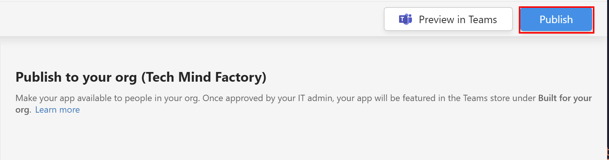

# Smart Assistant
This repository contains source code for the smart Azure Bot which is responsible for verifying employees' working time and notifying them when they work more than 40 hours per week.


# Infrastructure setup

This section contains details about infrastructure setup and configuration.

## Deploy Azure resources with GitHub Actions

Create a new application int the Azure Active Directory related to Azure subscription, where resources must be created, and assign Contributor role to it on the subscription level:


Then, fill out the below JSON:
 
 ```yaml
 {
    "clientId": "<GUID>",
    "clientSecret": "<GUID>",
    "subscriptionId": "<GUID>",
    "tenantId": "<GUID>"
  }
```
  
  * clientId - ID of the registered application in the Azure AD
  * clientSecret - generated secret for the registered application under *Certificates & secrets* tab
  * subscriptionId - ID of the subscription
  * tenantId - ID of Azure AD tenant related to Azure subscription (can be found under *Overview* tab of the Azure AD service)

Copy above value. Open the GitHub secrets section in the project settings and paste the above JSON result. The name of the secret should be: *AZURE_CREDENTIALS*.

Create two additional secrets:

1. AZURE_AD_TENANT_ID - with the ID of your Azure Active Directory tenant ID (can be found under *Overview* tab in the Azure AD blade in Azure portal)
2. AZURE_SUBSCRIPTION_ID - ID of your Azure subscription where you will deploy Azure resources


## Deploy Azure resources locally, using Visual Studio Code

In the Visual Studio code, sign in to your Azure tenant using *az login* command.

### Set current subscription:

`az account set --subscription <<subscription ID>>`

### Create resources with Bicep:

#### Create resource group:

`az group create --location westeurope --name rg-smart-assistant-dev`

#### Create [_smart-assistant-infrastructure.bicep_](https://github.com/Daniel-Krzyczkowski/Smart-Assistant/blob/main/src/infrastructure/smart-assistant-infrastructure.bicep) file:


#### Deploy template using below command using Azure CLI:

```
today=$(date +"%d-%b-%Y")
DeploymentName="deployment-"$today

az deployment group create \
  --name $DeploymentName \
  --resource-group rg-smart-assistant-dev \
  --template-file smart-assistant-infrastructure.bicep \
  --parameters location=westeurope tenantId=your-tenant-id
```

# Bot Web Application

In the repository you can also find the source code for the bot web application under [this](https://github.com/Daniel-Krzyczkowski/Smart-Assistant/tree/main/src/application/proactive-bot/TMF) link.

To access the endpoint which sends messages to Teams, we have to secure this endpoint with Azure AD to make sure that anonymous access is not allowed.

## Azure AD Application to represent Bot Web App

In the Azure AD we have to register a new app which will represent our Bot Web Application:


It is important to add role in the app manifest:

 ```yaml
    "appRoles": [
        {
            "allowedMemberTypes": [
                "Application"
            ],
            "description": "Access bot using client credentials flow",
            "displayName": "Access bot using client credentials flow",
            "id": "bc3b46b8-22ab-4868-8136-573a1a38233a",
            "isEnabled": true,
            "lang": null,
            "origin": "Application",
            "value": "access:bot"
        }
    ],
```

We need this role because we will obtain access token for the Azure Functions to call Bot Web App using client credentials flow.

# Azure Durable Functions 

Azure Durable Functions are used to communicate with Microsoft Graph to:

1. Get all users (employees) from the organization's Azure AD tenant
2. Query user's (employees) calendars to obain information about meetings and events
3. Calculate working hours from the last week
4. Send proactive message on Teams from the Azure bot

## Azure AD Application to authenticate with Microsoft Graph API

Authentication is required to obtain access tokens to securely communicate with Microsoft Graph API. Let's open existing application from the Azure AD so *bot-smart-assistant-func-app*. Three parameters are required:
1. Client ID
2. Tenant ID
3. Client Secret

We have to add three more permissions for the application:

1. Listing all users from the Azure AD tenant
2. Listing events from the user's calendar
3. Getting mailbox settings to detect if user has Exchange mailbox enabled


There is also one more permission to obtain an access token to call Bot Web App: *access:bot* which we configured in the previous step for Bot Web App.

# Microsoft Teams App setup with Azure Bot capability

This section contains details about Microsoft Teams App creation with Azure Bot capability.

## Create Microsoft Teams application with Developer Portal application

Microsoft Teams application can be created quickly using Developer Portal application available in the MS Teams.

You have to fill out required fields like long and short description or organization website:


To make it easier, I exported the application manifest so you can import the app without the need to fill in each detail. It is available in the repo under this link.

We have to provide our Azure Bot Application ID from the Azure AD where we registered the application for the bot to make it possible for bot to send messages through our MS Teams app:


### Register Azure AD application to access MS Graph API

We want our bot to proactively send messages to these employees who worked too much, so more than 40 hours per week. This requires two steps:

1. Installing Smart Assistant MS Teams app for specific user
2. Sending a proactive message on MS Teams once the application is installed

For this kind of scenario we use [*Proactive installation of apps using Graph API to send messages*](https://docs.microsoft.com/en-us/microsoftteams/platform/graph-api/proactive-bots-and-messages/graph-proactive-bots-and-messages). 

Application which we will register in the Azure AD tenant of our organization must have *TeamsAppInstallation.ReadWriteSelfForUser.All* permission assigned.

In the Azure AD management blade, we have to register new application with *TeamsAppInstallation.ReadWriteSelfForUser.All* permission:


We have to also fill Application ID with the value of client ID of the app we registered above:


## Submit Microsoft Teams application for acceptance

Once app is ready, we can publish it to our organization:



Before app can be used it has to be accepted by Teams administrator in the administrator portal. Publishing status has to be set to *Published*:


# CI/CD for Azure Functions and Bot Web App

Under [workflows](https://github.com/Daniel-Krzyczkowski/Smart-Assistant/tree/main/.github/workflows) folder you can find GitHub Actions script to build and deploy Azure Functions and Bot Web App.


# Additional, helpful links:

[How Microsoft Teams bots work](https://docs.microsoft.com/en-us/azure/bot-service/bot-builder-basics-teams?view=azure-bot-service-4.0&tabs=csharp)

[Proactive messages](https://docs.microsoft.com/en-us/microsoftteams/platform/bots/how-to/conversations/send-proactive-messages?tabs=dotnet)

[Manage custom app policies and settings in Microsoft Teams](https://docs.microsoft.com/en-us/microsoftteams/teams-custom-app-policies-and-settings)

[Build your first bot for Microsoft Teams](https://docs.microsoft.com/en-us/microsoftteams/platform/get-started/first-app-bot?tabs=vscode#register-your-web-service-with-the-bot-framework)

[Debug a bot from any channel using ngrok](https://docs.microsoft.com/en-us/azure/bot-service/bot-service-debug-channel-ngrok?view=azure-bot-service-4.0)

[Teams Conversation Bot](https://github.com/microsoft/BotBuilder-Samples/tree/main/samples/csharp_dotnetcore/57.teams-conversation-bot)

[MS Teams Developer portal](https://dev.teams.microsoft.com/)

[MS Teams Admin portal](https://admin.teams.microsoft.com/)

[Send proactive messages tutorial](https://docs.microsoft.com/en-us/microsoftteams/platform/sbs-send-proactive)

[Installing app for specific users using Graph API](https://github.com/microsoftgraph/contoso-airlines-teams-sample/blob/283523d45f5ce416111dfc34b8e49728b5012739/project/Models/GraphService.cs#L176)

[Proactive installation of apps using Graph API to send messages](https://docs.microsoft.com/en-us/microsoftteams/platform/graph-api/proactive-bots-and-messages/graph-proactive-bots-and-messages)

[Proactive Installation Sample App](https://github.com/OfficeDev/Microsoft-Teams-Samples/tree/main/samples/graph-proactive-installation/csharp)

[ConnectorClient](https://stackoverflow.com/questions/61797360/begin-dialog-with-connectorclient-in-microsoft-bot)

[Debug a bot from any channel using ngrok](https://docs.microsoft.com/en-us/azure/bot-service/bot-service-debug-channel-ngrok?view=azure-bot-service-4.0)

[Send and receive activities in the v3 C# SDK](https://docs.microsoft.com/en-us/previous-versions/azure/bot-service/dotnet/bot-builder-dotnet-connector?view=azure-bot-service-3.0)
